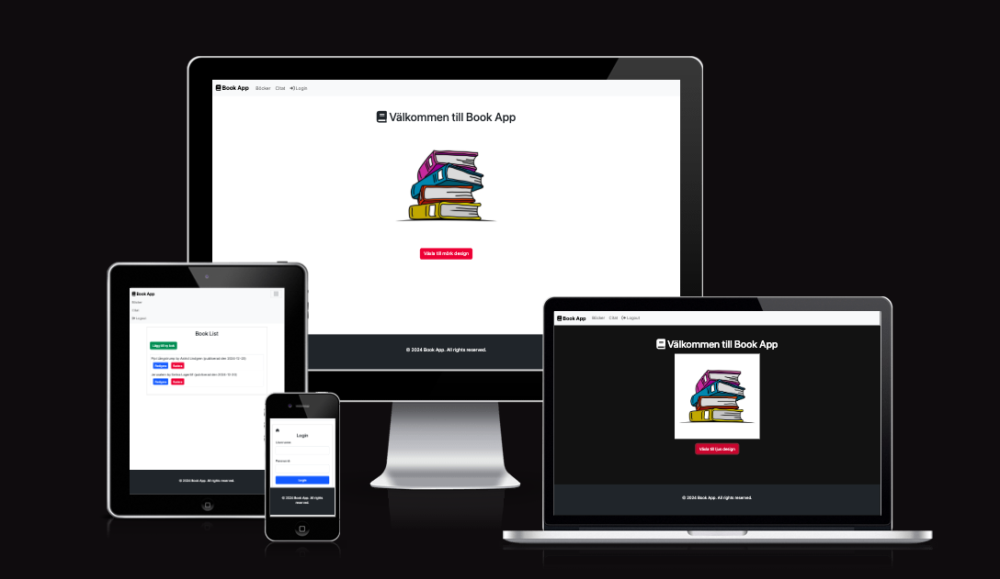

<h1 align="center"> BookApp - Create, Read, Update and Delete items</h1>

### Live Site

- Go to live site - [BookApp](https://book-app-angular18-net8.onrender.com/)

### Repository

- Go to the repository for this project - [Repository-BookApp](https://github.com/Askeran17/book-app-angular18-net8)

---

## Overview

This project is a web application built with Angular and .NET Core, designed for managing quotes and books. The frontend is developed using Angular, leveraging modules, components, and services to provide a user-friendly interface. The backend, built with .NET Core, includes an API that handles CRUD operations for quotes and books, supported by JWT authentication for secure access. The application integrates a PostgreSQL database to store data persistently. Additionally, it uses YARP for reverse proxy configuration to route requests appropriately between the frontend and backend. I used both swedish and english languages for this app.

### Database
The project uses the relational database PostgreSQL to store the data. I used PostgreSQL.

## Features

### Existing Features

__Header__

- The header has an adaptive navigation bar on the right. There are three links: books, quotes, login/logout. The visitor can easily navigate through these links thanks to the responsive bar. Also, in the mobile or medium screen extension version, there will be a “hamburger” icon on the right side of the adaptive panel, which means that the same links are hidden behind it. This is very convenient and allows you to take up less page space.

__Main content (Books)__

- When user is logged in, it will redirect to book-list page.

- If user click on add new book button (lägga till ny bok) it will refer to book-form.

- In the book form user will fill out titel, author name (författare) and published date of book.

- If user want to update so it need to click on uppdate button (redigera),

- and after that it will be refered to update form.

- When updating is done, click on update (uppdatera) and book will updated.

- If user want to delete book, just click on delete button (radera) and it will be deleted immediately.

__Quotes page__

- At the quotes page users can add their own favorite quotes, like it does at the book page. User can add (lägga till nytt citat), update (redigera) and delete (radera) quotes.

__Login/Logout__

- To access the application's capabilities user need to type login and password: 

-login: admin
-password: admin

__Theme__

- Users can also change between white and black theme, to switch from one to another, just click on switch button (växla till mörk/ljus design)

### Languages Used

HTML, CSS, JavaScript, Typescript, C#

### Frameworks Used

Angular, ASP.NET.Core, .NET Core 8

### Content 

- All text content for the site was written by myself.

### Media

- The images in site I took from open source, i.e. google.

## Testing

- I did manual testing, all of the features, buttons etc works well.

## Deployment

- Project was deployed on Heroku.
